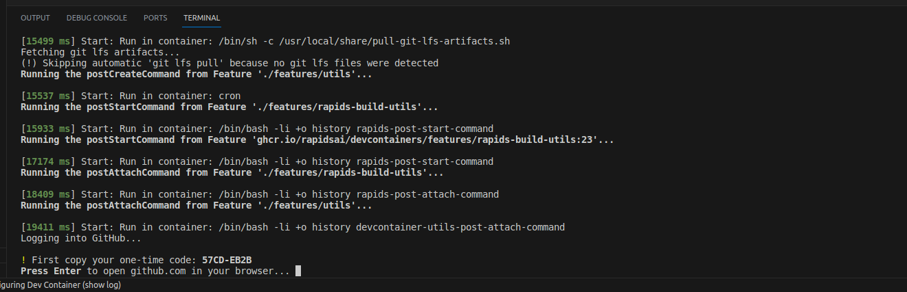

Preparing for Launch
-
This repository assumes that the Morpheus and MRC repositories are located in sister directories and named `mrc` and `morpheus`, respectively. If that's not the case, or you would like to use a clean clone for both MRC and Morpheus, clone this repository to a directory that contains no sister directories. For instance:

Option A (pre-cloned mrc and morpheus):
```
cwharris@charris-p620:~/dev/cyber$ pwd
/home/cwharris/dev/cyber
cwharris@charris-p620:~/dev/cyber$ ls -a
.   .aws    .conda   cyber-dev  dlfw-runner  morpheus-2  srv
..  .cache  .config  dlfw       morpheus     mrc
```

Option B (no pre-existing mrc and morpheus):
```
cwharris@charris-p620:~/dev/cyber/cyber-composite$ pwd
/home/cwharris/dev/cyber/cyber-composite
cwharris@charris-p620:~/dev/cyber/cyber-composite$ ls -a
.  ..  cyber-dev
```

If this is your first time using the repository, it is recommended to go with option B.

Launching
-
Open the cyber-dev repository root in VS Code and click the blue button at the bottom-right hand corner of the window titled "Reopen in Container".


The container will start via the devcontainer cli, and the associated output can be seen in the terminal.



Follow the instructions to authenticate with the GitHub CLI and propogate S3 credentials via Vault for sccache. This functionality is provided by [RAPIDS devcontainer features](https://github.com/rapidsai/devcontainers).


Cloning MRC and Morpheus
-

If you chose option A, please make sure you have checked out the branches associated with the pull requests below. If you chose option B (no pre-existing clones), you'll need to clone MRC and Morphues as sister repositories. To do that, open a new terminal and issue the command:
```
GIT_LFS_SKIP_SMUDGE=1 clone-all
```
This will clone both MRC and Morpheus to the appropriate sister directories and begin a conda environment solve based on the `dependencies.yaml`'s in those repositories. If you do not already have forks of MRC and Morpheus, you will be asked if you'd like to make them. The `GIT_LFS_SKIP_SMUDGE=1` is necessary because by default RAPIDS devcontainer build utilities clones LFS as well, which is typically not what we want and will make the terminal seem to hang.

- NOTE: Until the following PRs are merged and this repository is updated, any forks you make may have their upstream set to `cwharris/mrc` / `cwharris/morpheus`, and the upstreams will need to be changed at a later point:
    - https://github.com/nv-morpheus/utilities/pull/55
    - https://github.com/nv-morpheus/MRC/pull/375
    - https://github.com/nv-morpheus/Morpheus/pull/1171

Please make sure you have checked out the branches associated with the pull requests above.

Building MRC and Morpheus
-
Configuration, compilation, and in-place install of MRC and Morpheus can be performed after the conda environment solve from the previous step completes. To do this issue the following command:
```
build-all
```
This will configure, build, and in-place install MRC and Morpheus according to the [manifest.yaml](manifest.yaml), ensuring that Morpheus is compiled and linked against the locally built MRC.

If you would like to perform a debug build, simply pass extra cmake arguments to `build-all`:
```
build-all -DCMAKE_BUILD_TYPE=Debug
```